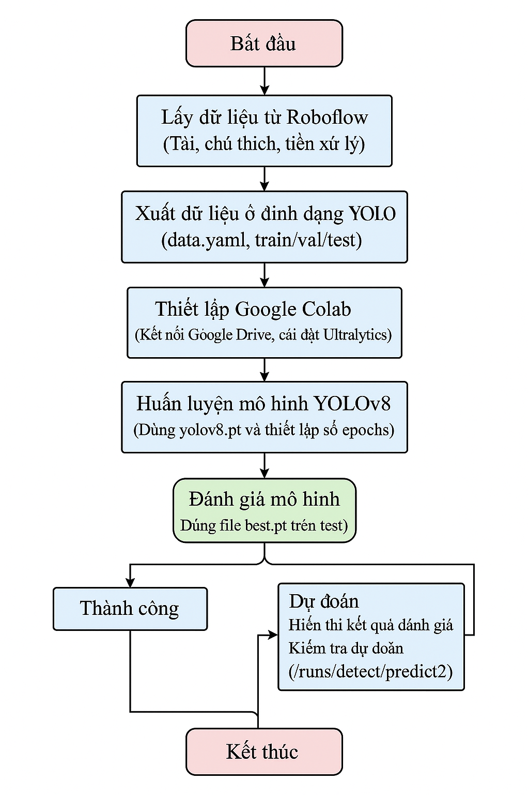

## Doãn Bùi Hòa Hợp 
### 🚦 Hệ thống Giám sát Giao thông sử dụng YOLOv8
### 🎯 Mục tiêu Dự án
* Dự án hướng đến việc xây dựng một hệ thống giám sát giao thông thông minh ứng dụng thị giác máy tính (Computer Vision) và mô hình học sâu YOLOv8 để tự động phát hiện và phân loại các đối tượng giao thông như ô tô, xe máy, người đi bộ và biển báo.
## 1. Tổng quan đề tài  
* Đặt Vấn Đề: Trong khuôn khổ của sự phát triển nhanh chóng của công nghệ và đô thị hóa, việc đảm bảo an toàn giao thông trở thành một thách thức lớn. Biển báo giao thông đóng vai trò quan trọng trong việc hướng dẫn và bảo vệ người tham gia giao thông. Tuy nhiên, việc nhận diện biển báo một cách chính xác và kịp thời, đặc biệt trong điều kiện giao thông phức tạp tại Việt Nam, vẫn là một bài toán khó cần được giải quyết.
* Tầm Quan Trọng của Đề Tài: Nhận diện biển báo giao thông không chỉ cần thiết cho việc tuân thủ luật lệ giao thông mà còn là một yếu tố cốt lõi trong việc phát triển xe tự hành và các hệ thống hỗ trợ lái xe hiện đại.
* Mục Tiêu của Đồ Án: Mục tiêu của đồ án này là phát triển một hệ thống nhận diện biển báo giao thông chính xác và kịp thời sử dụng công nghệ deep learning, đặc biệt tập trung vào dữ liệu từ môi trường giao thông Việt Nam.
* Ý Nghĩa Ứng Dụng: Ứng dụng của hệ thống này không chỉ giới hạn trong việc nâng cao an toàn giao thông mà còn mở rộng sang các lĩnh vực như hỗ trợ lái xe tự động và quản lý giao thông thông minh.
# Mục tiêu cụ thể bao gồm:
*  🔍 Tự động phát hiện đối tượng trong thời gian thực từ hình ảnh hoặc video giám sát.
*  🚦 Theo dõi và phân tích lưu lượng giao thông nhằm hỗ trợ quản lý hạ tầng đô thị.
*  ⚠️ Phát hiện tình huống bất thường hoặc hành vi vi phạm, như vượt đèn đỏ hoặc đi sai làn.
*  🛡️ Tăng cường an toàn đường bộ thông qua cảnh báo sớm và trích xuất thông tin giao thông.
* Dự án không chỉ minh chứng khả năng ứng dụng các kỹ thuật AI tiên tiến vào bài toán thực tế, mà còn thể hiện năng lực xây dựng hệ thống thị giác máy hoàn chỉnh – từ thu thập dữ liệu, huấn luyện mô hình, đến triển khai và đánh giá hiệu suất.
# Input
* Ảnh: File ảnh tĩnh (e.g., JPG) chứa các phương tiện giao thông.
* Video: Khung hình từ file video (e.g., MP4) được xử lý từng frame.
* Webcam: Luồng hình ảnh trực tiếp từ webcam.
# Output
* Bounding Box quanh phương tiện: Hình chữ nhật bao quanh từng phương tiện, vẽ bằng màu sắc nổi bật (e.g., xanh lá, hồng).
* Mã của phương tiện: Nhãn định danh (e.g., "motorbike", "car", "truck") hiển thị cạnh bounding box
## 2. Xây dựng bộ dữ liệu 6,130 Files ('bicycle1 , bus, car , motorbike,  person, truck' ) 
### 2.1. Thu thập dữ liệu
## 📊 Sơ đồ hệ thống
* 
### 🔁 Các bước thực hiện
* Thiết lập môi trường**: kết nối Drive, bật TPU.
* Cài đặt thư viện**: `ultralytics`, `opencv-python`,...
* Chuẩn bị dữ liệu**: phân loại, gán nhãn (LabelImg/Roboflow).
* Huấn luyện mô hình**: với YOLOv8 trên tập dữ liệu custom.
* Trực quan hóa**: loss, mAP, precision, recall qua biểu đồ.
* Đánh giá mô hình**: so sánh dự đoán và ground truth.
* Kiểm tra dự đoán**: chạy thử trên ảnh, video thực tế.
### 🧠 Kỹ thuật sử dụng nổi bật
* YOLOv8 object detection
* Real-time video inference (OpenCV)
* Custom dataset training
* Visualization & evaluation (mAP, precision)
* Sử dụng Google Colab + Drive linh hoạt
✅ Kết luận
Dự án đã chứng minh khả năng ứng dụng YOLOv8 trong xây dựng hệ thống giám sát giao thông thông minh, giúp tự động phát hiện và phân loại các đối tượng trên đường phố với độ chính xác cao.
+ Qua dự án, thực hiện đã phát triển được kỹ năng về:
* Xử lý ảnh và video thực tế với OpenCV.
* Huấn luyện và tối ưu mô hình deep learning trên môi trường GPU/TPU.
* Đánh giá hiệu suất mô hình với các chỉ số chuẩn (mAP, precision, recall).
* Hiểu rõ quy trình xây dựng hệ thống computer vision từ đầu đến cuối.
* Dự án có tiềm năng phát triển thành hệ thống giám sát giao thông thực tế, hỗ trợ an toàn và quản lý đô thị thông minh trong tương lai.
### ✅ Kết luận
* Dự án là minh chứng cho việc ứng dụng thành công mô hình học sâu **YOLOv8** vào một bài toán thực tế, với tiềm năng triển khai thực tiễn cao. Các kỹ năng về **deep learning, computer vision, xử lý video, deployment** đều được thể hiện rõ ràng.
### 🔗 Liên kết
* [Notebook Colab ](Hethonggiamsatxe.ipynb) (Hethonggiamsatxe.ipynb)
### 📷 Demo kết quả
                  Class     Images  Instances      Box(P        R       mAP50   mAP50-95)
                  all         705        7503     0.862      0.783       0.87      0.651
               bicycle        233        291      0.935      0.835      0.916      0.687
                   bus         91        116      0.773      0.897      0.921      0.809
                   car        572       4376      0.917      0.903      0.953      0.735
             motorbike        318        846      0.813      0.616      0.766      0.512
                person        433       1748      0.773      0.671      0.765      0.416
                 truck        116        126      0.961      0.775      0.897      0.747
*  
* 📹 [Xem video giám sát]([videogiamsat.mp4](https://drive.google.com/file/d/1IWLQiKgj6sofnJvudbJS_6ATldWtbn8A/view?usp=sharing))
